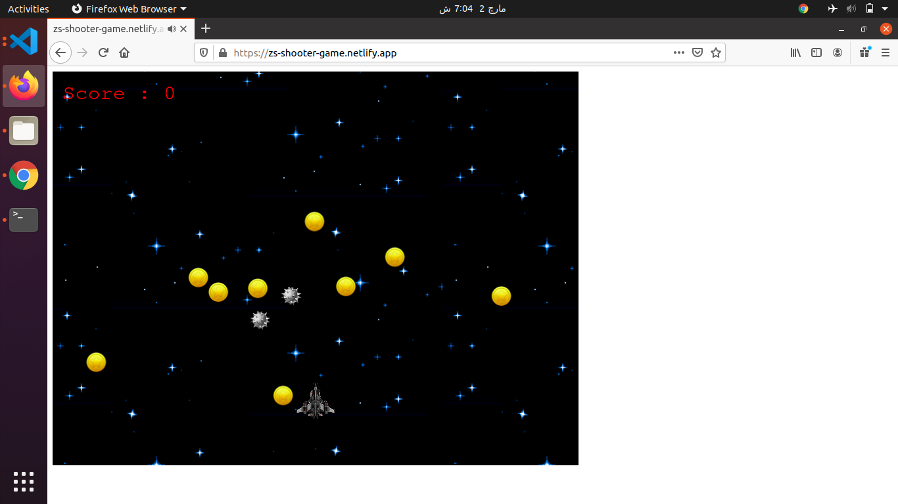

# Space-Shooter-Game-Js

> Shooter game built with Javascript using Phaser and Webpack. Capstone Project for Microverse on the top of my Javascript knowledge.

### Screes

## Game Design

The concept of game design is simple, as shown on screens. A jet in space shoots the bombs and collects coins to get scores. If the Jet collides with a bomb, the game is over. All assets are provided by code4cause.

## Built With

- HTML
- JAVASCRIPT
- PHASER 3
- NPM
- WEBPACK
- JEST
- GITHUB ACTIONS

## Live Demo

[Live Demo Link](https://zs-shooter-game.netlify.app/)

## Instructions to Play

- Enter your name.

- Press 'Play' to start playing.

- Press 'Options' to enable/disable sound features.

- Press 'Credits' to see who made it possible.

- To play you need the Keyboard and the Mouse.

- CONTROLS:

  - Press 'Up Arrow' to move Up.

  - Press 'Down Arrow' to move Down.

  - Press 'Left Arrow' to move Left.

  - Press 'Right Arrow' to move Right.

  - Press 'Right Click' to SHOOT.

- Use the mouse for the non-game and dialogues screens.

- Have Fun Playing!

## Getting Started

### Usage

- Click the Live Demo link and enjoy playing the shooter game.

### Setup

- Clone the repository on your local machine
- Cd into the folder
- Run `npm install`
- Run `npm start`
- On your browser, make sure you point to the right address (i.e: http://localhost:8080/)

### Run tests

- Run `npm test` on the root directory to run all the tests.

## Author Details::

👤 **Muhammad Talha Waqar**

- Github: [@LamiaSristy](https://github.com/talhawaqar)
- Linkedin: [@LamiaSristy](https://www.linkedin.com/in/talhawaqar/)
- E-mail: <a href="mailto:talhawaqar007@gmail.com?subject=Hello Talha!">Email</a>
- Twitter: [@LamiaSristy](https://twitter.com/MuhammadTalhaW4)

## Contributing

There are two ways of contributing to this project:

1. If you see something wrong or not working, please open the issue in issue section
2. If you see something to improve or to correct, and you have a solution to that, follow the below steps to contribute:
   1. Fork this repository
   2. Clone it on your local computer by running `git clone https://github.com/talhawaqar/Shooter-Game-Phaser3Js.git` **Replace _your username_ with the username you use on github**
   3. Open the cloned repository which appears as a folder on your local computer with your favorite code editor
   4. Create a separate branch off the _master branch_,
   5. Write your codes which fix the issue you found
   6. Commit and push the branch you created
   7. Open a pull request, comparing your new created branch with our original master branch [here](https://github.com/talhawaqar/Shooter-Game-Phaser3Js/pulls)

## Show your support

Give a ⭐️ if you like this project!

## Acknowledgment

- [Microverse](https://www.microvese.org)
- [The Odin Project](https://www.theodinproject.com)
